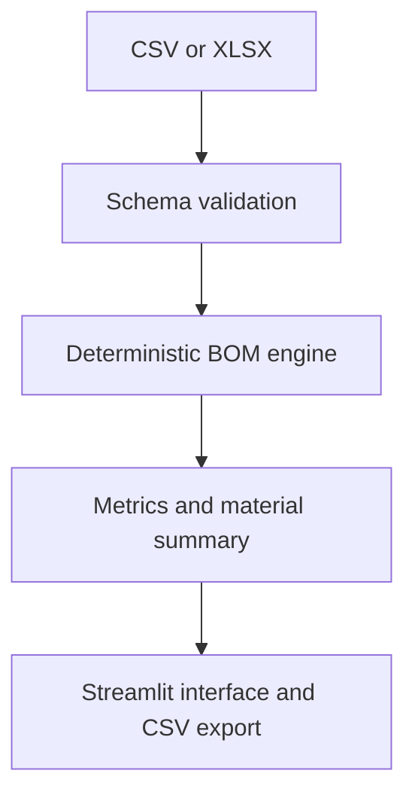

# Engineering BOM Intelligence

[](https://github.com/Sembla/Engineering-BOM-Intelligence/actions/workflows/tests.yml)

A tested Python and Streamlit prototype for validating engineering BOM data, calculating material consumption and estimating cost using explicit measurement rules.

This project is connected to a real engineering problem: area-based materials, linear profiles and unit components cannot be costed with the same formula. The calculation engine therefore supports three measurement bases and keeps the business rules separate from the interface.

> All bundled data is synthetic. Cost results are estimates for demonstration and are not production quotations.

## What the project demonstrates

- Input validation with actionable error messages.
- Separate calculations for `area_m2`, `linear_m` and `unit` components.
- Waste-factor application and estimated-cost calculation.
- Material-level summaries and transparent rule-based review flags.
- CSV/XLSX upload and calculated CSV export.
- A calculation engine that can be tested without Streamlit.

## Architecture



| Component | Responsibility |
|---|---|
| `bom_engine.py` | Validation, measurement rules, calculations, summaries and review flags |
| `app.py` | Upload, filters, metrics, tables and export interface |
| `tests/test_bom_engine.py` | Unit tests for formulas and validation boundaries |

## Data contract

| Column | Description |
|---|---|
| `item` | Component name |
| `family` | Product or assembly family |
| `component_type` | Engineering classification |
| `width_mm`, `height_mm` | Dimensions used by `area_m2` rows |
| `length_mm` | Dimension used by `linear_m` rows |
| `quantity` | Required component count; must be greater than zero |
| `material` | Material description |
| `measure_basis` | `area_m2`, `linear_m` or `unit` |
| `unit_cost` | Cost per selected measurement basis |
| `waste_pct` | Additional purchasing allowance |

No engineering dimensions or price tables are bundled in this public repository. The numeric examples used by the automated tests are synthetic and exist only to verify the formulas.

## Run locally

```bash
python -m venv .venv
source .venv/bin/activate
pip install -r requirements.txt
streamlit run app.py
```

On Windows PowerShell, activate the environment with:

```powershell
.venv\Scripts\Activate.ps1
```

## Run the tests

```bash
python -m unittest discover -s tests -v
```

The tests cover all three cost bases, aggregate metrics, schema validation, invalid values and review flags.

The same test suite runs automatically on every push and pull request through GitHub Actions.

## Calculation model

For area-based components:

```text
base measure = width_mm × height_mm ÷ 1,000,000
```

For linear components:

```text
base measure = length_mm ÷ 1,000
```

For unit components, the base measure is `1`. The final calculation is:

```text
purchase measure = base measure × quantity × (1 + waste_pct ÷ 100)
estimated cost = purchase measure × unit_cost
```

## Limitations

- The project does not generate cutting plans or nesting layouts.
- Cost tables are supplied by the user and are not connected to an ERP.
- Review flags are deterministic rules, not AI-generated engineering decisions.
- Uploaded files are processed in the active Streamlit session and are not persisted by this prototype.

## Next engineering steps

- Add unit normalization and currency configuration.
- Introduce versioned price tables.
- Add CAD/ERP import adapters.
- Generate traceable calculation logs for audit and quotation workflows.

## Author

Henrique Sembla — [GitHub](https://github.com/Sembla) · [LinkedIn](https://www.linkedin.com/in/henriquessembla)
