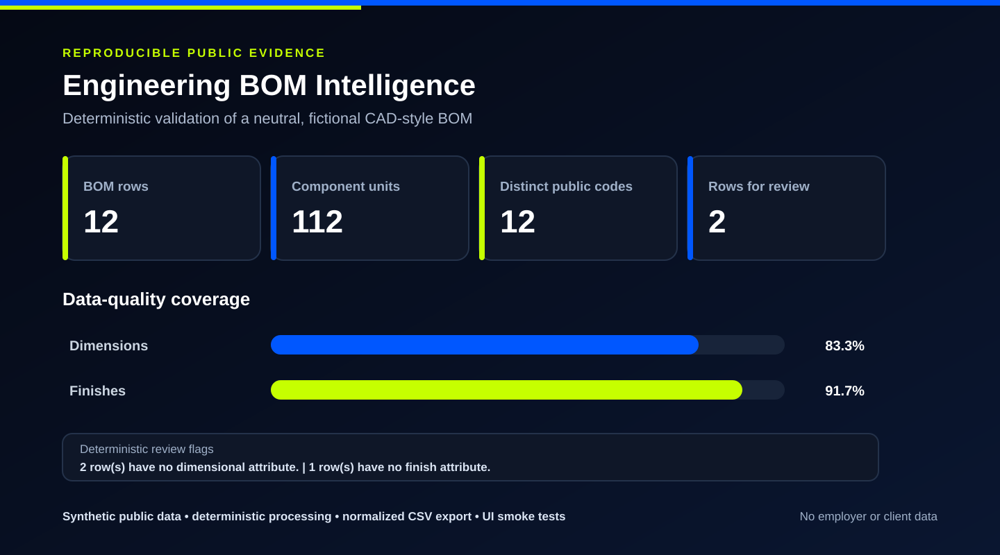
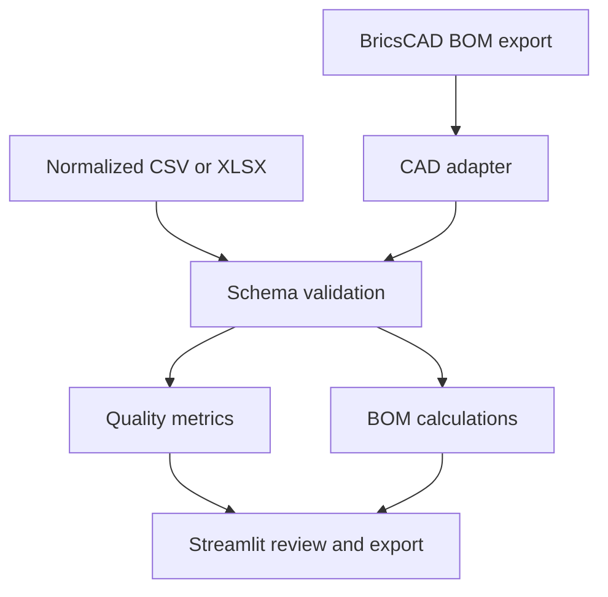

# Engineering BOM Intelligence

[](https://github.com/Sembla/Engineering-BOM-Intelligence/actions/workflows/tests.yml)

A tested Python and Streamlit project for turning CAD-exported bills of materials into normalized, reviewable engineering data. It also supports deterministic material-consumption and estimated-cost calculations for already normalized BOMs.

## The real workflow behind the project

This repository was motivated by a real workflow in which parametric information from a BricsCAD project was exported to a structured BOM. The public repository intentionally does not reproduce the original field names, codes, component vocabulary or measurements.

The public implementation recreates the reusable integration layer:

1. detect a neutral CAD-style CSV export;
2. map public generic fields to a stable data contract;
3. validate quantities and dimensional fields;
4. classify components with transparent rules;
5. calculate coverage and review indicators;
6. export a normalized BOM for downstream analysis.

> The original project BOM and its mapping rules are not included. The bundled sample and public schema were created from scratch with generic field names and fictional values. They contain no employer, client, catalogue or production-project information.

## Reproducible demo evidence

[](docs/evidence/validation-report.json)

This snapshot is generated by the repository code from the bundled fictional sample. It is not a manually designed claim or a production-data screenshot. The evidence pipeline normalizes the public CAD-style BOM, calculates deterministic quality metrics and writes three reviewable artifacts:

- [Visual validation snapshot](docs/evidence/demo-summary.svg)
- [Machine-readable validation report](docs/evidence/validation-report.json)
- [Normalized demonstration BOM](docs/evidence/normalized-demo-bom.csv)

Run `python scripts/generate_demo_evidence.py` to reproduce them. GitHub Actions regenerates the same files and fails if the committed evidence is out of date.

## What the project demonstrates

- A CAD-specific import adapter instead of a manually rewritten spreadsheet.
- Automatic detection of raw CAD and normalized engineering schemas.
- A neutral public schema that is independent from the original export vocabulary.
- Numeric validation with actionable source-row messages.
- Component classification and material inference using explicit rules.
- Dimension and finish coverage metrics for data-quality review.
- Separate calculations for `area_m2`, `linear_m` and `unit` components.
- CSV/XLSX upload, normalized CSV export and automated unit tests.
- Executable Streamlit smoke tests and deterministic evidence generation.

## Architecture



| Component | Responsibility |
|---|---|
| `cad_adapter.py` | Neutral CAD detection, normalization and deterministic quality flags |
| `bom_engine.py` | Measurement rules, consumption, estimated cost and material summaries |
| `app.py` | Synthetic demo, uploads, metrics, review tabs and CSV export |
| `data/sample_cad_bom.csv` | Fictional sample using a neutral public schema |
| `tests/` | Formula, schema, adapter and quality-boundary tests |

## Accepted input 1: neutral public CAD schema

Only three columns are mandatory. Dimension and finish columns are optional.

| Raw column | Normalized meaning |
|---|---|
| `item_id` | Fictional or externally sanitized item identifier |
| `item_description` | Generic public description |
| `quantity` | Component quantity |
| `row_id` | Optional source row identifier |
| `dimension_x_mm`, `dimension_y_mm`, `dimension_z_mm` | Optional generic dimensions |
| `finish_primary`, `finish_secondary` | Optional generic finish attributes |

CAD rows enter the calculation engine with `measure_basis=unit` and zero cost. A private organization-specific mapping layer would be required before using an internal export; that mapping is deliberately outside this repository.

## Accepted input 2: normalized costing BOM

| Column | Description |
|---|---|
| `item`, `family`, `component_type` | Component identity and engineering classification |
| `width_mm`, `height_mm` | Dimensions used by `area_m2` rows |
| `length_mm` | Dimension used by `linear_m` rows |
| `quantity` | Required component count; must be greater than zero |
| `material` | Material description |
| `measure_basis` | `area_m2`, `linear_m` or `unit` |
| `unit_cost` | Cost per selected measurement basis |
| `waste_pct` | Additional purchasing allowance |

## Run locally

```bash
python -m venv .venv
source .venv/bin/activate
pip install -r requirements.txt
streamlit run app.py
```

On Windows PowerShell:

```powershell
.venv\Scripts\Activate.ps1
```

The app opens with the fictional CAD sample when no upload is supplied, so the workflow can be evaluated immediately.

## Run the tests

```bash
python -m unittest discover -s tests -v
```

The 16-test suite covers the three costing bases, validation boundaries, neutral CAD-schema detection, normalization, quality metrics, review flags, the Streamlit interface and evidence reproducibility. GitHub Actions runs it on every push and pull request.

## Calculation model

For area-based components:

```text
base measure = width_mm × height_mm ÷ 1,000,000
```

For linear components:

```text
base measure = length_mm ÷ 1,000
```

For unit components, the base measure is `1`. The final calculation is:

```text
purchase measure = base measure × quantity × (1 + waste_pct ÷ 100)
estimated cost = purchase measure × unit_cost
```

## Boundaries

- This is a neutral CSV/XLSX demonstration, not a live BricsCAD API integration.
- Employer-specific field mappings and component vocabulary are intentionally excluded.
- The project does not generate cutting plans or nesting layouts.
- Cost tables are supplied by the user and are not connected to an ERP.
- Review flags are deterministic and do not replace engineering validation.
- Uploaded files are processed in the active Streamlit session and are not persisted.

## Next engineering steps

- Add configurable mappings for other CAD export templates.
- Introduce versioned price tables and currency configuration.
- Add ERP adapters and traceable calculation logs.
- Compare BOM revisions and highlight changed quantities or attributes.

## Author

Henrique Sembla — [GitHub](https://github.com/Sembla) · [LinkedIn](https://www.linkedin.com/in/henriquessembla)
